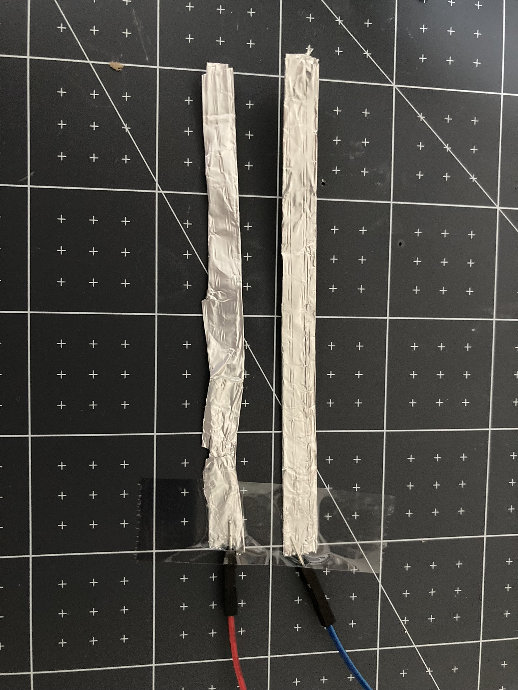

To craft a drop switch for your Raspberry Pi Pico, you will need:

+ A Raspberry Pi Pico
+ 2 x socket-pin jumper wires
+ Sticky tape
+ Kitchen foil or conductive tape

**Instructions**

**Step 1**: Create two conductive strips either with kitchen foil or conductive tape. 
**Step 2**: Stick the pin ends of the jumper wire to each strip.

{:width="400px"}

**Step 3**: Stick some kitchen foil or conductive tape to the bottom of an object. The base must be large enough to create a connection between the two wires.

{:width="400px"}

**Step 4**: Attach the socket ends of the jumper wires to your Raspberry Pi Pico and drop your switch!

