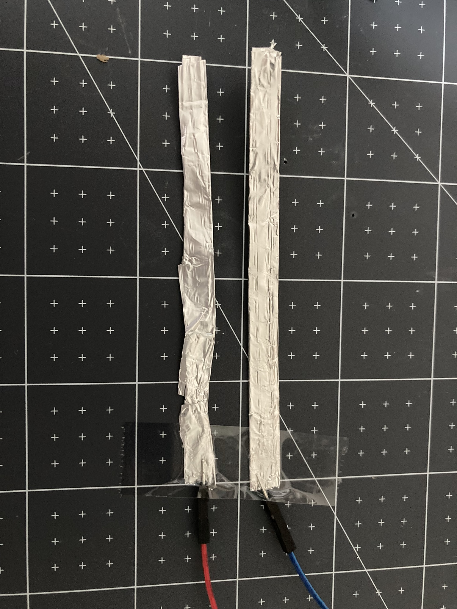

Pour fabriquer un interrupteur pour ton Raspberry Pi Pico, tu auras besoin de :

+ Un Raspberry Pi Pico
+ 2 x fils de liaison prise-broche
+ Bande adhésive
+ Papier d'aluminium ou ruban conducteur

**Instructions**

**Étape 1** : Crée deux bandes conductrices avec du papier d'aluminium ou du ruban conducteur.
**Étape 2** : Colle les extrémités des fils de connexion sur chaque bande.

{:width="400px"}

**Étape 3** : Colle du papier d'aluminium ou du ruban adhésif conducteur au bas d'un objet. La base doit être suffisamment grande pour créer une connexion entre les deux fils.

{:width="400px"}

**Étape 4** : Attache les extrémités des fils de connexion à ton Raspberry Pi Pico et dépose ton interrupteur !

