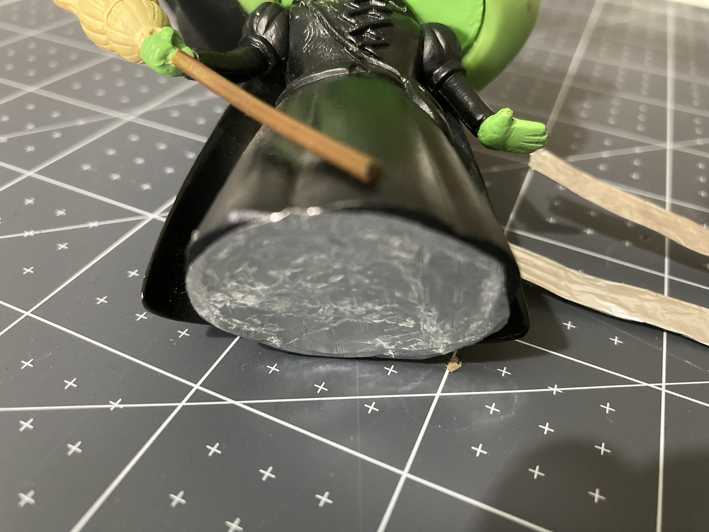

Om een springplank-schakelaar voor je Raspberry Pi Pico te maken, heb je nodig:

+ Een Raspberry Pi Pico
+ 2× bus–pen verbindingsdraden
+ Plakband
+ Keukenfolie of geleidende tape

**Instructies**

**Stap 1**: Maak twee geleidende strips met keukenfolie of geleidende tape. **Stap 2**: Plak de pen-uiteinden van de verbindingsdraad aan elke strip.

{:width="400px"}

**Stap 3**: Plak wat aluminiumfolie of geleidende tape op de bodem van een voorwerp. De basis moet groot genoeg zijn om een verbinding tussen de twee draden te maken.

{:width="400px"}

**Stap 4**: Bevestig de busuiteinden van de verbindingsdraden aan je Raspberry Pi Pico en laat je voorwerp vallen!

